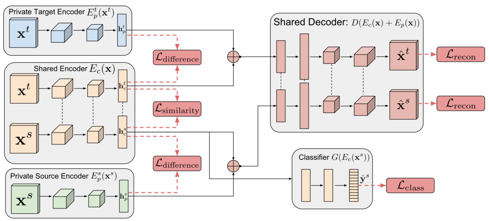
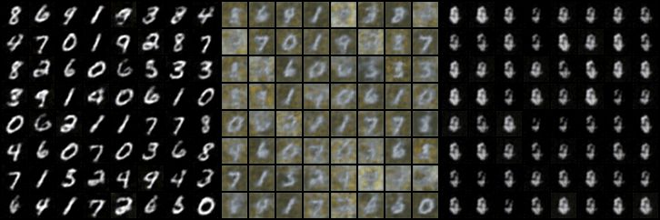
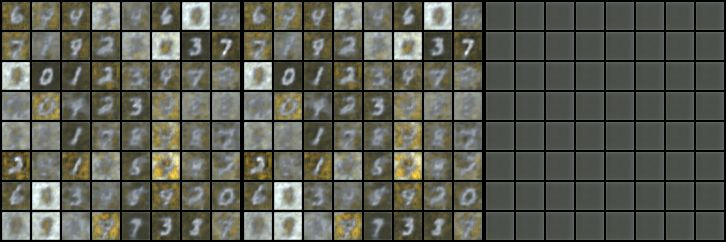

## This is a pytorch implementation of the model [Domain Separation Networks](https://arxiv.org/abs/1608.06019)

## Environment
- Pytorch 0.4.0
- Python 2.7

## Network Structure

## Usage

`python train.py`

**Note that this model is very sensitive to the loss weight, our implementation cannot perform as perfect as the
original paper, so be careful when you tune parameters for other datasets. Moreover, this model may not be suitable
for real nature image, cause the private and shared feature of nature image are more complicated, so that *difference 
loss* cannot adapt well** 

## Result

We only conduct the experiments from mnist to mnist_m, the target accuracy of our implementation is about 77% (original
paper ~83%), and some results are shown as follows, from left to right: recovery from shared+private, shared and private
features.

